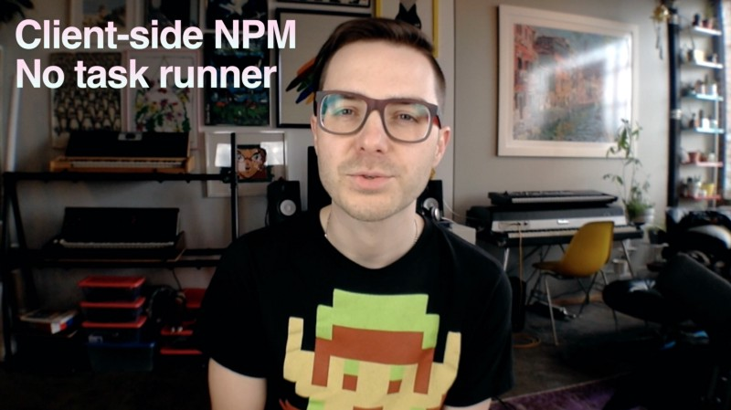

## NPM client-side without a task runner

This is the code written in my [video tutorial](https://www.youtube.com/watch?v=k1aeg5lAzVk "Watch the tutorial on YouTube") on using NPM in the browser without the need for additional task runners like Gulp or Grunt. Its only dependencies are Browserify, Watchify, and NPM itself.

[Watch the tutorial on YouTube](https://www.youtube.com/watch?v=k1aeg5lAzVk "Watch the tutorial on YouTube")

To try it out:

1. Clone the repo.
2. Navigate to the repo directory and run `npm install` from the command line.
3. Run `npm run watch` from the command line.
4. Start up a web server from the repo directory and navigate to `index.html`.
5. Open your browser console. You should see a sorted array of numbers.
